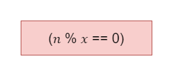

# Exercício 04 - parte 02
  
## Introdução 

_"Seja 𝑛 um inteiro positivo e seja 𝒟𝑛 o conjunto formado pelos divisores positivos de 𝑛. Por exemplo, 𝒟6 = {1, 2, 3, 6} e 𝒟7 = {1, 7}. Escreva uma expressão lógica que, dados dois inteiros positivos, 𝑛 e 𝑥, assume o valor T, se 𝑥 pertence ao conjunto 𝒟𝑛, ou F, caso contrário.   Dica: Utilize o operador de resto da divisão (mod)."_

## Resolução

Se o resto da divisão de x por n for igual a zero, pertence ao conjunto. 😉

