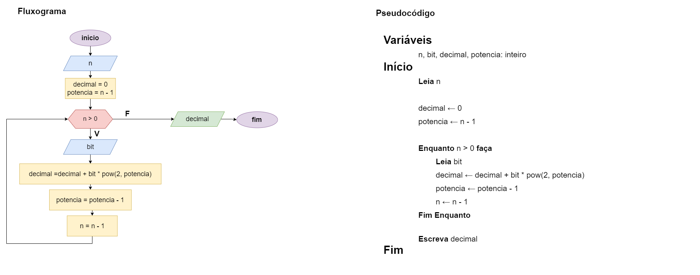

# Exercício 08 - parte 04
  
## Introdução 

_"Escreva um fluxograma e um pseudocódigo para um algoritmo que lê um inteiro
positivo 𝑛 qualquer, seguido de mais 𝑛 inteiros, cada um sendo 0 ou 1, que compõem
os bits da representação binária de um número, e escreve esse número (em decimal).    
Assuma que os bits são informados do mais significativo para o menos significativo.
Por exemplo:    
• Se a entrada for 4 1 0 1 1, a saída deve ser 11.  
• Se a entrada for 8 1 0 1 1 0 1 1, a saída deve ser 91.  
Assuma a existência de uma função chamada pow que recebe dois números 𝑎 e 𝑏 e
retorna 𝑎
𝑏
. Por exemplo, pow(2, 5) = 32.
"_

## Resolução

