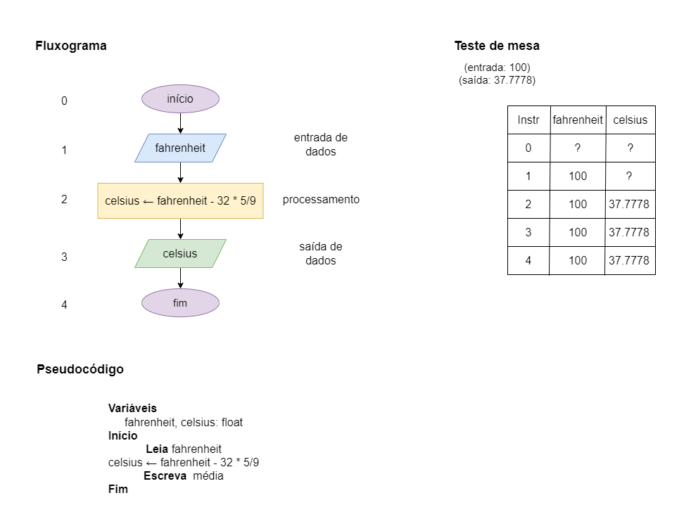

# Exercício 01 - parte 01
  
## Introdução  
Escreva um fluxograma e um pseudocódigo para um algoritmo que lê um número real representando uma temperatura em graus Fahrenheit e escreve esta temperatura em graus Celsius.

Lembre-se que para converter de Fahrenheit para Celsius, basta subtrair 32 e multiplicar por 5/9. 

Em seguida, execute um teste de mesa com a entrada 100; a saída deve ser 37.7778.

## Resolução

