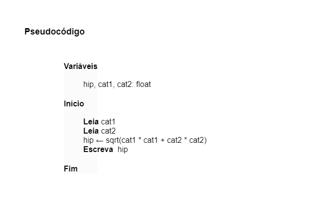

# Exercício 02 - parte 01
  
## Introdução  
Implemente um algoritmo, na forma de pseudocódigo, para determinar a hipotenusa
de um triângulo retângulo, dados os seus catetos. 

Quais são os dados de entrada?

As variáveis que receberão estes dados devem ser que que tipo? 

Quais são os dados de saída?

Estes dados serão armazenados em variáveis de que tipo? 

Obs: Assuma que há uma função sqrt que calcula raiz quadrada.

## Resolução

- **Dados de entrada:** São os catetos do triângulo.
- **Tipos das variáveis:** Ponto flutuante (Float ou Double).
- **Dados de saída:** É o valor da hipotenusa do triângulo.

