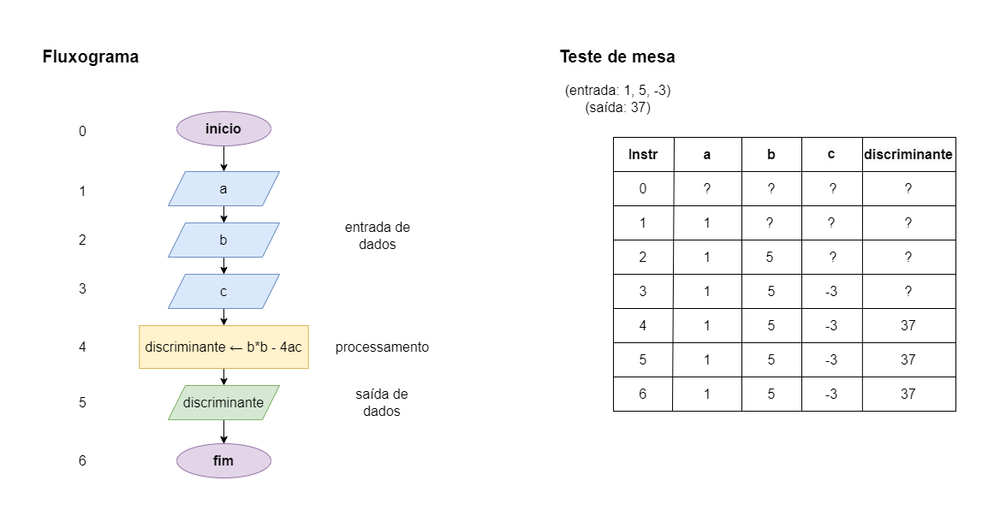

# Exercício 03 - parte 01
  
## Introdução  
Escreva um fluxograma para um algoritmo que lê três números reais 𝑎, 𝑏 e 𝑐, representando os coeficientes de uma equação de segundo grau, e escreve o valor do discriminante Δ = 𝑏^2 − 4𝑎𝑐 da equação. 

Assuma que não há operador de exponenciação disponível. 

Em seguida, execute um teste de mesa com a entrada 1, 5, -3; asaída deve ser 37.

## Resolução

