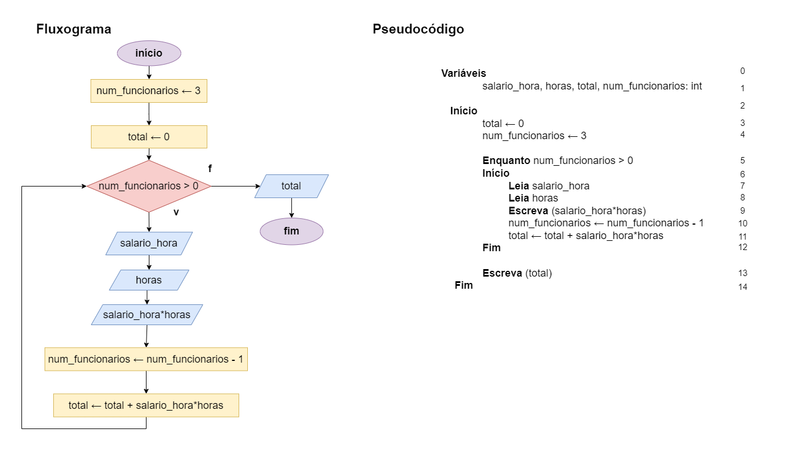

# Exercício 05 - parte 01
  
## Introdução  
Escreva um fluxograma e um pseudocódigo para um algoritmo que lê os salários por
hora (em R$ por hora) e as horas trabalhadas de três colaboradores de uma empresa
e escreve o pagamento de cada um deles, bem como o total pago pela empresa.

Não utilize mais que quatro variáveis. A ordem de leitura dos dados de entrada deve ser:
Salário do colaborador 1, horas trabalhadas do colaborador 1, salário do
colaborador 2, horas trabalhadas do colaborador 2, salário do colaborador 3,
horas trabalhadas do colaborador 3.

A ordem de escrita dos dados de saída deve ser:
Pagamento do colaborador 1, pagamento do colaborador 2, pagamento do colaborador 3, total pago pela empresa.

Em seguida, execute um teste de mesa com a entrada 50, 8, 60, 7, 50, 7.5; a saída
deve ser 400, 420, 375, 1195.

## Resolução

### Teste de mesa

(falta fazer! 😛)

