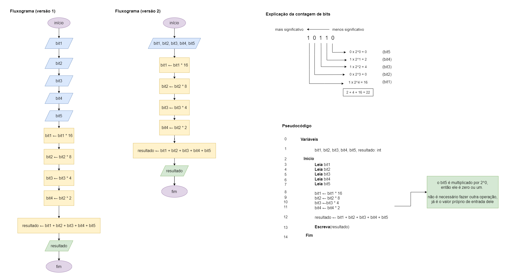

# Exercício 05 - parte 01
  
## Introdução  
Escreva um fluxograma e um pseudocódigo para um algoritmo que lê cinco inteiros,
cada um sendo 0 ou 1, que compõem os bits da representação binária de um número,
e escreve esse número (em decimal).

Assuma que os bits são informados do mais significativo para o menos significativo.

Em seguida, execute um teste de mesa com a entrada 1, 0, 1, 1, 0; a saída deve ser 22

## Resolução

### Teste de mesa

(falta fazer! 😛)

